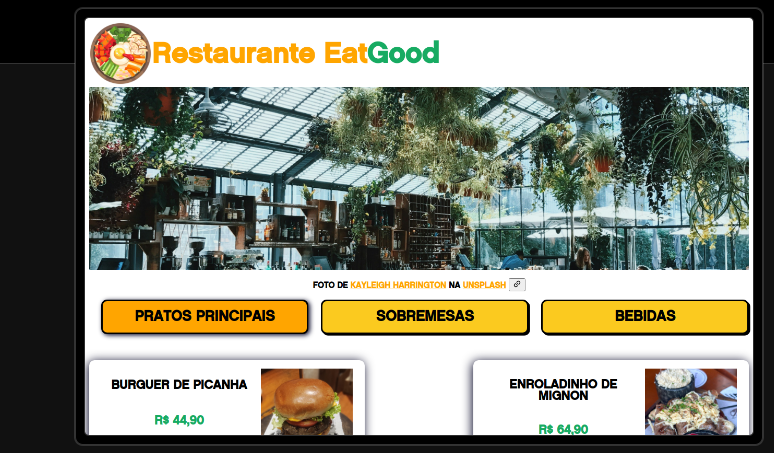
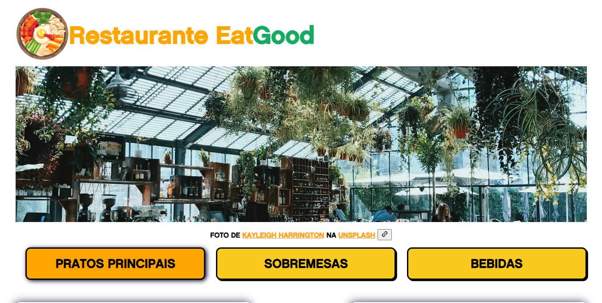
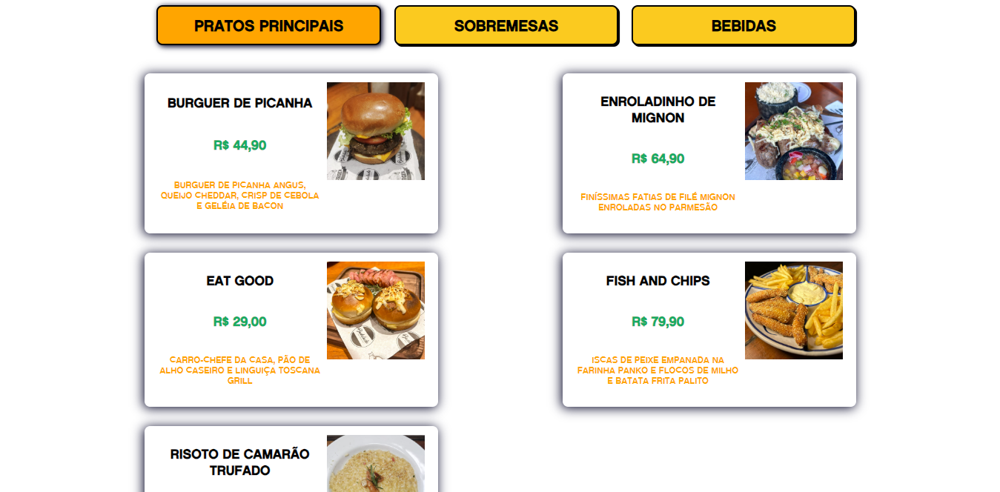
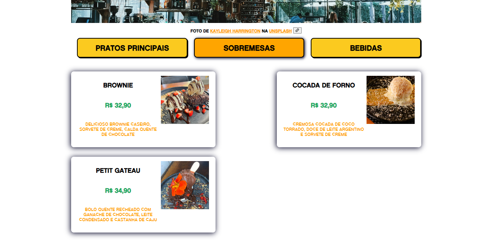
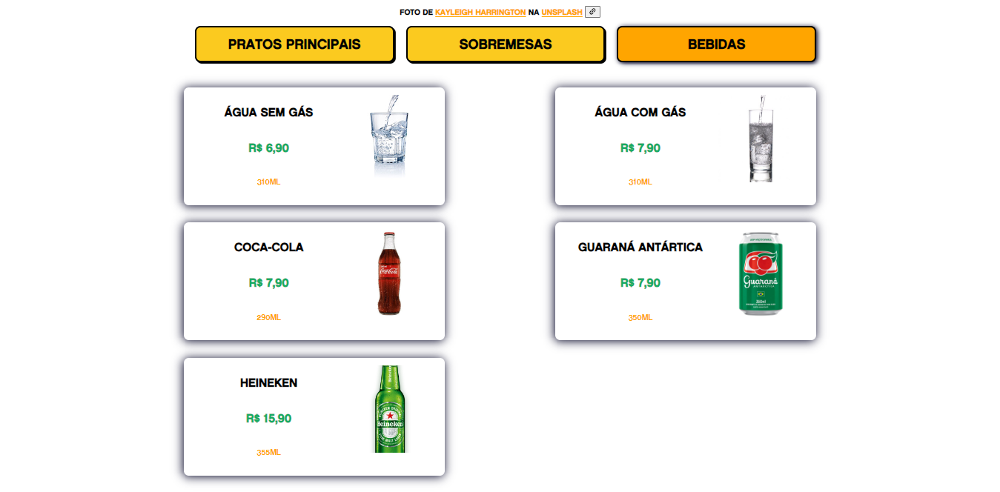

# Projeto Restaurante EatGood

## 📝Finalidade
- Site desenvolvido para simulação de um restaurante com cardápio online

## 👨‍💻Funcionalidade
- [x] Projeto feito com HTML, CSS e JavaScript.

- [x] O usuário pode escolher entre as três opções de cardápios.

# 📸Prints

## 🗳️Topo da página
<hr>

## 🍔Pratos Principais
<hr>

## 🍫Sobremesas
<hr>

## 🍹Bebidas
<hr>


## 💻Como rodar este projeto?

Após clonar o repositório, acesse a pasta do projeto e execute os comandos abaixo:

```bash
npm install
npm run dev
```

Acesse [http://localhost:5173](http://localhost:5173) para visualizar a aplicação.

## 🔧Tecnologias Utilizadas 
1. [HTML- Linguagem de Marcação de Hipertexto](https://pt.wikipedia.org/wiki/HTML)<hr>
2. [CSS](https://pt.wikipedia.org/wiki/Cascading_Style_Sheets)<hr>
3. [JS- JavaScript](https://www.javascript.com)<hr>
4. [Vite](https://vitejs.dev/)<hr>
5. [Visual Studio Code](https://code.visualstudio.com)<hr>
6. [Figma](https://www.figma.com/)<hr>

## 📀Demonstração

# Demonstração do projeto

- [Deploy do Projeto EatGood](https://projeto-eatgood.vercel.app/)
